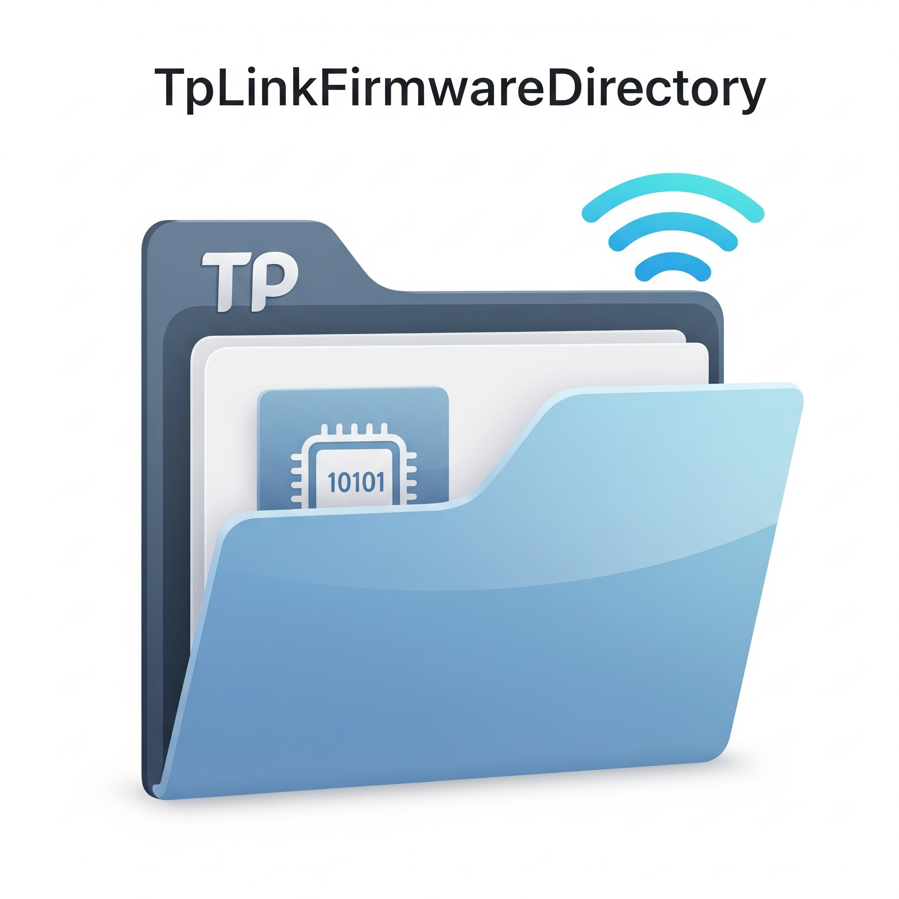

<!-- Improved compatibility of back to top link: See: https://github.com/othneildrew/Best-README-Template/pull/73 -->
<a id="readme-top"></a>

[![Contributors][contributors-shield]][contributors-url]
[![Forks][forks-shield]][forks-url]
[![Stargazers][stars-shield]][stars-url]
[![Issues][issues-shield]][issues-url]
[![project_license][license-shield]][license-url]

<br />
<div align="center">
  <a href="https://github.com/LoveDoLove/TpLinkFirmwareDirectory">
    
  </a>

<h3 align="center">TpLink Firmware Directory</h3>

  <p align="center">
    List all downloadable software keys from <code>http://download.tplinkcloud.com/</code> for easy search and reference.
    <br />
    <a href="https://github.com/LoveDoLove/TpLinkFirmwareDirectory"><strong>Explore the docs »</strong></a>
    <br />
    <br />
    <a href="https://github.com/LoveDoLove/TpLinkFirmwareDirectory">View Demo</a>
    &middot;
    <a href="https://github.com/LoveDoLove/TpLinkFirmwareDirectory/issues/new?labels=bug&template=bug-report---.md">Report Bug</a>
    &middot;
    <a href="https://github.com/LoveDoLove/TpLinkFirmwareDirectory/issues/new?labels=enhancement&template=feature-request---.md">Request Feature</a>
  </p>
</div>

<details>
  <summary>Table of Contents</summary>
  <ol>
    <li>
      <a href="#about-the-project">About The Project</a>
      <ul>
        <li><a href="#built-with">Built With</a></li>
      </ul>
    </li>
    <li>
      <a href="#getting-started">Getting Started</a>
      <ul>
        <li><a href="#prerequisites">Prerequisites</a></li>
        <li><a href="#installation">Installation</a></li>
      </ul>
    </li>
    <li><a href="#usage">Usage</a></li>
    <li><a href="#roadmap">Roadmap</a></li>
    <li><a href="#contributing">Contributing</a></li>
    <li><a href="#license">License</a></li>
    <li><a href="#contact">Contact</a></li>
  </ol>
</details>

## About The Project

This project provides a searchable list of all keys for software downloadable from [download.tplinkcloud.com](http://download.tplinkcloud.com/). It uses a Python script to list all objects in the public S3 bucket and saves them to `all_keys.txt` for convenience and reference.

### Built With

* Python 3.13+
* [boto3](https://boto3.amazonaws.com/v1/documentation/api/latest/index.html)
* [botocore](https://botocore.amazonaws.com/v1/documentation/api/latest/index.html)

<p align="right">(<a href="#readme-top">back to top</a>)</p>

## Getting Started

Follow these steps to set up the project locally.

### Prerequisites

* Python 3.13+
* [uv](https://github.com/astral-sh/uv/releases/latest) (for fast Python dependency management)

Download `uv` from its [official repository](https://github.com/astral-sh/uv/releases/latest) or website, and follow the installation instructions provided there.

### Installation

1. Clone the repo
   ```sh
   git clone https://github.com/LoveDoLove/TpLinkFirmwareDirectory.git
   ```
2. Sync the dependencies using uv:
   ```sh
   uv sync
   ```
3. Run the script to generate the listing:
   ```sh
   python list_s3_files.py
   ```
   This will create `all_keys.txt` containing all keys from the bucket.

<p align="right">(<a href="#readme-top">back to top</a>)</p>

## Usage

To update the listing, run:
```sh
python list_s3_files.py
```
The output file `all_keys.txt` will contain all available keys from the S3 bucket.

Example AWS CLI command for manual listing:
```sh
aws s3 ls --recursive download.tplinkcloud.com --no-sign-request
```

_For more examples, please refer to the [Documentation](https://github.com/LoveDoLove/TpLinkFirmwareDirectory)_

<p align="right">(<a href="#readme-top">back to top</a>)</p>

## Roadmap

- [ ] Add filtering options for keys
- [ ] Add web interface for searching
- [ ] Add automated updates
    - [ ] Scheduled listing refresh

See the [open issues](https://github.com/LoveDoLove/TpLinkFirmwareDirectory/issues) for a full list of proposed features (and known issues).

<p align="right">(<a href="#readme-top">back to top</a>)</p>

## Contributing

Contributions are what make the open source community such an amazing place to learn, inspire, and create. Any contributions you make are **greatly appreciated**.

If you have a suggestion that would make this better, please fork the repo and create a pull request. You can also simply open an issue with the tag "enhancement".
Don't forget to give the project a star!

1. Fork the Project
2. Create your Feature Branch (`git checkout -b feature/AmazingFeature`)
3. Commit your Changes (`git commit -m 'Add some AmazingFeature'`)
4. Push to the Branch (`git push origin feature/AmazingFeature`)
5. Open a Pull Request

<p align="right">(<a href="#readme-top">back to top</a>)</p>

## License

Distributed under the MIT License. See `LICENSE` for more information.

<p align="right">(<a href="#readme-top">back to top</a>)</p>

## Contact

LoveDoLove - [@LoveDoLove](https://twitter.com/LoveDoLove)

Project Link: [https://github.com/LoveDoLove/TpLinkFirmwareDirectory](https://github.com/LoveDoLove/TpLinkFirmwareDirectory)

<p align="right">(<a href="#readme-top">back to top</a>)</p>

<!-- MARKDOWN LINKS & IMAGES -->
[contributors-shield]: https://img.shields.io/github/contributors/LoveDoLove/TpLinkFirmwareDirectory.svg?style=for-the-badge
[contributors-url]: https://github.com/LoveDoLove/TpLinkFirmwareDirectory/graphs/contributors
[forks-shield]: https://img.shields.io/github/forks/LoveDoLove/TpLinkFirmwareDirectory.svg?style=for-the-badge
[forks-url]: https://github.com/LoveDoLove/TpLinkFirmwareDirectory/network/members
[stars-shield]: https://img.shields.io/github/stars/LoveDoLove/TpLinkFirmwareDirectory.svg?style=for-the-badge
[stars-url]: https://github.com/LoveDoLove/TpLinkFirmwareDirectory/stargazers
[issues-shield]: https://img.shields.io/github/issues/LoveDoLove/TpLinkFirmwareDirectory.svg?style=for-the-badge
[issues-url]: https://github.com/LoveDoLove/TpLinkFirmwareDirectory/issues
[license-shield]: https://img.shields.io/github/license/LoveDoLove/TpLinkFirmwareDirectory.svg?style=for-the-badge
[license-url]: https://github.com/LoveDoLove/TpLinkFirmwareDirectory/blob/master/LICENSE
[linkedin-shield]: https://img.shields.io/badge/-LinkedIn-black.svg?style=for-the-badge&logo=linkedin&colorB=555
[linkedin-url]: https://linkedin.com/in/linkedin_username
[product-screenshot]: images/screenshot.png
